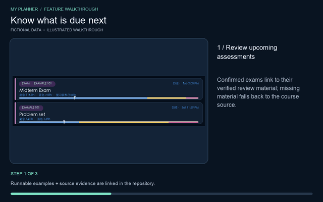
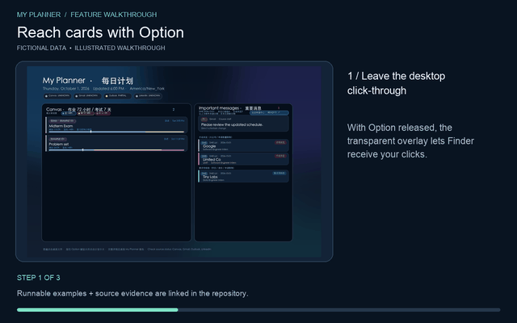
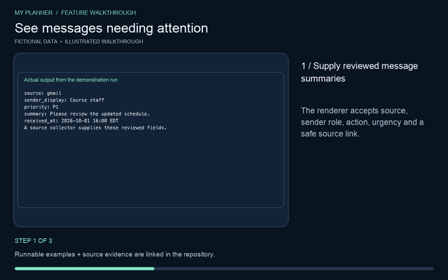
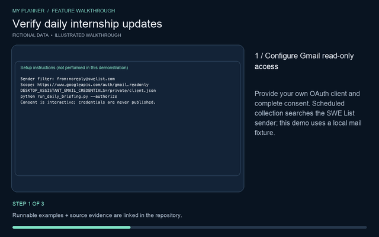
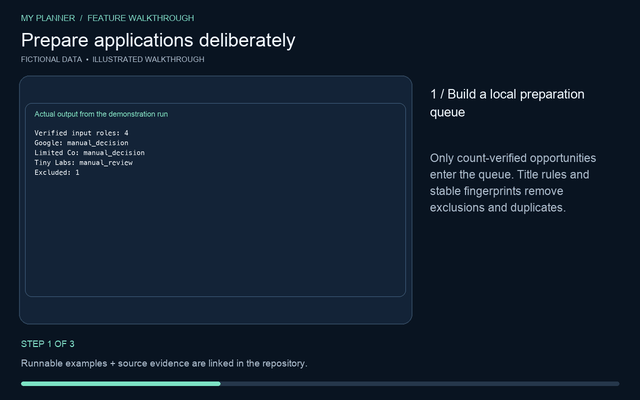
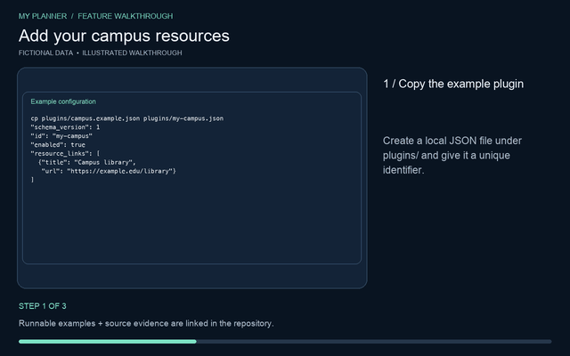
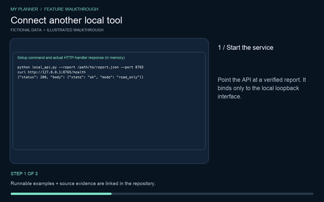
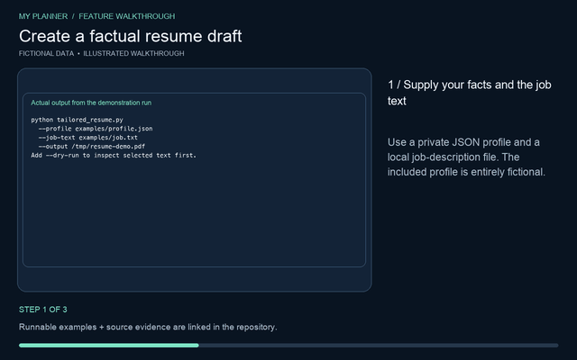
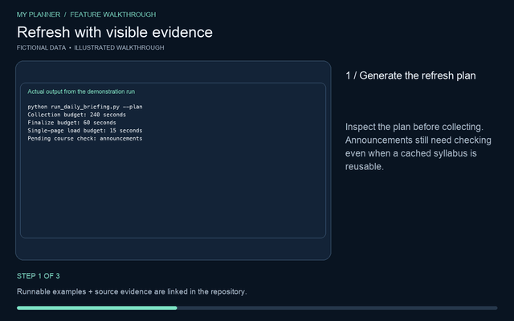

# macOS Desktop Assistant

macOS Desktop Assistant turns the desktop wallpaper into a private, always-available dashboard for coursework, important messages, and internship opportunities. It renders one structured briefing into a wallpaper, a detailed local planner, and a set of pixel-aligned desktop links.

The project grew out of a problem I kept running into as a student: assignments, exams, recruiting updates, and important email all live in different systems. This brings the information that needs attention into one place while keeping the original source one click away.


## Feature demonstrations

Each feature below includes a short explanation, an animated walkthrough, and a downloadable MP4. The demos are generated from the real renderer, parsers, filters, API, and PDF builder using fictional data; they do not expose live accounts or personal information.

### 1. Wallpaper dashboard and full planner

The renderer turns a briefing into three coordinated views: a 3024×1964 wallpaper, a detailed Markdown report, and a local HTML planner. The wallpaper keeps the highest-priority items visible, while the planner preserves full details and source links.

- Exams appear before assignments, important messages, and internship opportunities.
- Every visible card is tied to a safe destination URL.
- The same input can be previewed without changing the current wallpaper.

[](macos-desktop-assistant-upload/docs/media/01-dashboard.mp4)

[Watch the MP4](macos-desktop-assistant-upload/docs/media/01-dashboard.mp4) · [Open the sample planner](macos-desktop-assistant-upload/docs/media/planner-demo.html) · [Read the sample report](macos-desktop-assistant-upload/docs/media/briefing-demo.md)

### 2. Assignment deadlines, exams, and review material

The planner separates formal assessments from ordinary coursework. It displays confirmed exams within seven days and actionable assignments within 72 hours, while keeping a full-term exam inventory in local state.

- Submitted, completed, exempt, cancelled, undated, and expired assignments are removed.
- Confirmed exams can link directly to verified study guides, practice exams, formula sheets, or review pages.
- Missing or incomplete course coverage stays visibly partial instead of being reported as “nothing due.”

[](macos-desktop-assistant-upload/docs/media/02-deadlines-exams.mp4)

[Watch the MP4](macos-desktop-assistant-upload/docs/media/02-deadlines-exams.mp4)

### 3. Option-key desktop navigation

The companion app adds an interaction layer that remains transparent during normal desktop use. Holding Option reveals the dashboard’s clickable regions; releasing it restores click-through behavior so Finder icons continue to work normally.

- Hold Option to highlight and activate individual wallpaper cards.
- Double-tap Option to bring the full planner in front of other windows.
- Hotspots only activate when their image hash and geometry match the verified wallpaper.

[](macos-desktop-assistant-upload/docs/media/03-option-navigation.mp4)

[Watch the MP4](macos-desktop-assistant-upload/docs/media/03-option-navigation.mp4)

### 4. Privacy-conscious important-message summaries

Important messages are reduced to the information needed for action: source, sender role or organization, requested action, and urgency. Full bodies, codes, phone numbers, grades, financial details, and private meeting links are not placed on the wallpaper.

- P0 identifies items that need attention within 24 hours.
- P1 covers direct requests, academic notices, recruiting updates, and project coordination within 72 hours.
- Authentication and collection failures remain visible as source errors rather than becoming empty inboxes.

[](macos-desktop-assistant-upload/docs/media/04-important-messages.mp4)

[Watch the MP4](macos-desktop-assistant-upload/docs/media/04-important-messages.mp4)

### 5. Daily internship discovery from SWE List

The Gmail integration uses a separate read-only OAuth scope to process SWE List daily updates. A message is accepted only after its sender, headline count, and unique company/role/application-link count agree.

- Every posting is parsed into company, role, and its own application URL.
- Stable fingerprints remove duplicates across daily updates.
- A count mismatch blocks the batch and preserves the last verified result instead of presenting partial data as complete.

[](macos-desktop-assistant-upload/docs/media/05-swe-list.mp4)

[Watch the MP4](macos-desktop-assistant-upload/docs/media/05-swe-list.mp4)

### 6. Deliberate application preparation

Verified opportunities can enter a local preparation queue, but the scheduled workflow never submits an application. Eligibility, work authorization, degree requirements, and application limits must be reviewed before a role can be considered ready.

- Large employers and companies with application limits stay in a manual-decision section.
- Unverified requirements stay pending; the system does not guess that a role is eligible.
- Starting an application batch creates a visible interactive review, and only an official success page can mark an application submitted.

[](macos-desktop-assistant-upload/docs/media/06-application-preparation.mp4)

[Watch the MP4](macos-desktop-assistant-upload/docs/media/06-application-preparation.mp4)

### 7. Campus resource plugins

Data-only JSON plugins add campus-specific links to the local planner without allowing downloaded code to execute. A plugin declares its identity, label, enabled state, and HTTPS resources.

- Copy the included example to create a campus configuration.
- Invalid, duplicate, disabled, or unsafe entries are rejected by the loader.
- Enabled resources appear beside the planner’s built-in source links.

[](macos-desktop-assistant-upload/docs/media/07-campus-plugins.mp4)

[Watch the MP4](macos-desktop-assistant-upload/docs/media/07-campus-plugins.mp4) · [Open the example plugin](macos-desktop-assistant-upload/plugins/campus.example.json)

### 8. Read-only local integration API

A loopback-only API lets another local tool consume verified opportunity summaries. It exposes health and opportunity endpoints but no application, email, or state-mutation endpoint.

- The service binds to `127.0.0.1` rather than the public network.
- Only strictly filtered, verified role summaries are returned.
- Mutation requests receive an explicit `405 Method Not Allowed` response.

[](macos-desktop-assistant-upload/docs/media/08-local-api.mp4)

[Watch the MP4](macos-desktop-assistant-upload/docs/media/08-local-api.mp4)

### 9. Fact-preserving tailored resume drafts

The resume generator uses a user-authored JSON profile and a local job description to select and reorder existing skills and experience. It produces a PDF review draft without inventing or rewriting experience.

- Matching is based on overlap with the supplied job description.
- All personal facts remain user-provided and local.
- The generated PDF is intended for review before use in an application.

[](macos-desktop-assistant-upload/docs/media/09-tailored-resume.mp4)

[Watch the MP4](macos-desktop-assistant-upload/docs/media/09-tailored-resume.mp4) · [Open the sample PDF](macos-desktop-assistant-upload/docs/media/resume-demo.pdf)

### 10. Bounded refresh, verification, and recovery

Refresh runs are planned before collection and use explicit time budgets. Source status, report generation, wallpaper application, all-space synchronization, lock-screen source, and overlay integrity are verified separately.

- Cached course documents can be reused by content hash, while announcements are still checked for changes.
- Local finalization runs once after collection and atomically writes the report, image, and hotspot manifest.
- A failed presentation check preserves the last known-good wallpaper instead of claiming success.

[](macos-desktop-assistant-upload/docs/media/10-refresh-recovery.mp4)

[Watch the MP4](macos-desktop-assistant-upload/docs/media/10-refresh-recovery.mp4) · [Inspect the demo evidence](macos-desktop-assistant-upload/docs/media/evidence.json)

## How the pieces fit together

```text
Authenticated collectors / local fixtures
                  │
                  ▼
        structured daily_briefing.json
                  │
       ┌──────────┼───────────┐
       ▼          ▼           ▼
  wallpaper    HTML planner   Markdown report
       │
       ▼
SHA-256 hotspot manifest ──► Option-key companion overlay

SWE List mail ──► strict verification ──► preparation queue
                                             │
                                             ├─ manual decision
                                             ├─ requirements review
                                             └─ user-started application workflow
```

## Quick start

Requirements: macOS, Python 3.11 or newer, and the packages in `requirements.txt`.

```bash
cd macos-desktop-assistant-upload
python3 -m venv .venv
.venv/bin/pip install -r requirements.txt
.venv/bin/python -m unittest discover -s tests -q
.venv/bin/python render_daily_briefing.py \
  --input examples/daily_briefing.example.json \
  --png /tmp/desktop-assistant-demo.png \
  --markdown /tmp/desktop-assistant-demo.md \
  --html /tmp/desktop-assistant-demo.html \
  --hotspots /tmp/desktop-assistant-demo-hotspots.json
```

The renderer does not change the desktop unless `--set-wallpaper` is supplied. The sample data is fictional, so the project can be evaluated without connecting an account.

To build the macOS companion, run:

```bash
cd macos-desktop-assistant-upload
sh build_app.sh
```

An ad-hoc signed development build is also included at [`downloads/My-Planner-macOS.zip`](macos-desktop-assistant-upload/downloads/My-Planner-macOS.zip). It is not an Apple-notarized installer.

## Local API

```bash
cd macos-desktop-assistant-upload
.venv/bin/python local_api.py --report /path/to/daily_briefing.json --port 8765
curl http://127.0.0.1:8765/health
curl http://127.0.0.1:8765/v1/opportunities
```

## Tailored resume draft

```bash
cd macos-desktop-assistant-upload
.venv/bin/python tailored_resume.py \
  --profile /path/to/private-profile.json \
  --job-text /path/to/job-description.txt \
  --output /path/to/tailored-resume.pdf
```

The included [`examples/profile.json`](macos-desktop-assistant-upload/examples/profile.json) contains fictional information. Private profiles, credentials, tokens, generated reports, and personal resumes should stay outside the repository.

## Privacy and safety boundaries

- Gmail access is read-only and uses a token separated from any compose-capable outreach token.
- The repository contains source code, tests, and fictional examples, not live course records, messages, credentials, tokens, or personal resumes.
- Scheduled runs do not open, fill, or submit external applications.
- Canvas, Outlook, and LinkedIn collection depends on each user’s authenticated session and is intentionally separate from the fictional example data.
- Local-model privacy work is experimental and is not presented here as a shipped feature.

## Project structure

| Path | Purpose |
| --- | --- |
| `render_daily_briefing.py` | Wallpaper, Markdown, HTML, and hotspot rendering |
| `run_daily_briefing.py` | Refresh planning and local finalization pipeline |
| `MyPlannerCompanion.m` | macOS Option-key overlay companion |
| `assignment_filters.py` | Assignment and assessment visibility rules |
| `swe_list_summary.py` | Strict SWE List parsing and count verification |
| `intern_preparation.py` | Stable fingerprints and preparation queue |
| `local_api.py` | Loopback-only read API |
| `plugin_sources.py` | Data-only campus resource plugins |
| `tailored_resume.py` | Fact-preserving local PDF resume generator |
| `tests/` | Unit tests for filters, collection, queue, API, overlay, and recovery |
| `docs/media/` | Ten GIF/MP4 feature demonstrations and evidence |

All project files currently live inside the repository’s `macos-desktop-assistant-upload/` directory, so the links in this root README intentionally include that prefix.

## Reproducing the demonstrations

With FFmpeg, FFprobe, and Poppler available on `PATH`, run:

```bash
cd macos-desktop-assistant-upload
python tools/build_feature_demos.py
```

The script uses fixed fictional fixtures, calls the real project functions, verifies their results, and rebuilds the images, GIFs, MP4s, sample report, planner, PDF, and machine-readable evidence.

