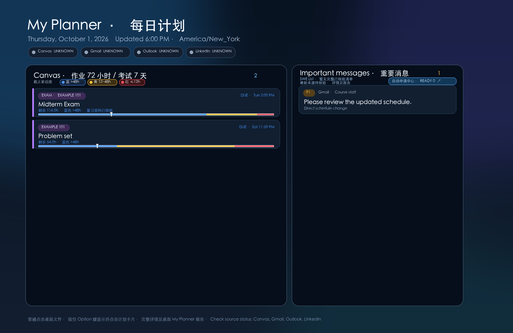
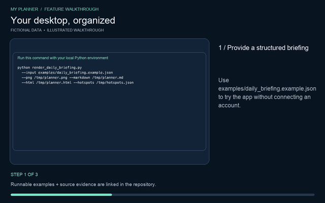

# macOS Desktop Assistant

A local-first planner that turns a macOS wallpaper into a dashboard for course deadlines, exams, important messages, and internship opportunities. The desktop card layer is transparent to Finder files until Option is held; double-tapping Option opens the full planner in the foreground.

This repository contains **source code and fictional examples only**. It intentionally excludes live email, course records, résumés, credentials, tokens, wallpapers, and run-state files.



## See every feature in action

[**Watch the feature video gallery**](https://henry653.github.io/macos-desktop-assistant/) · [**Step-by-step illustrated guide**](docs/FEATURES.md)

Every feature has a diagram, a three-step walkthrough, an animated preview, and a 16-second MP4. The media use actual outputs from the renderer, parser, filters, local API and PDF generator with **fictional data**. They are illustrated walkthroughs, not recordings of live account access; the Option-key sequence is explicitly an interaction illustration.

| Feature | Illustrated guide | Video |
| --- | --- | --- |
| Wallpaper, local planner and full report | [Dashboard](docs/FEATURES.md#your-desktop-organized) | [MP4](docs/media/01-dashboard.mp4) |
| Exam review links, full-term inventory and deadline filtering | [Exams and deadlines](docs/FEATURES.md#know-what-is-due-next) | [MP4](docs/media/02-deadlines-exams.mp4) |
| Hold Option / double-tap Option | [Keyboard navigation](docs/FEATURES.md#reach-cards-with-option) | [MP4](docs/media/03-option-navigation.mp4) |
| Important-message summaries and source status | [Messages](docs/FEATURES.md#see-messages-needing-attention) | [MP4](docs/media/04-important-messages.mp4) |
| Gmail SWE List parsing and count verification | [Daily openings](docs/FEATURES.md#verify-daily-internship-updates) | [MP4](docs/media/05-swe-list.mp4) |
| Eligibility review, manual decisions and application preparation | [Preparation queue](docs/FEATURES.md#prepare-applications-deliberately) | [MP4](docs/media/06-application-preparation.mp4) |
| Campus resource plugins | [Plugins](docs/FEATURES.md#add-your-campus-resources) | [MP4](docs/media/07-campus-plugins.mp4) |
| Local read-only outreach API | [API](docs/FEATURES.md#connect-another-local-tool) | [MP4](docs/media/08-local-api.mp4) |
| Fact-preserving tailored résumé PDFs | [Résumé drafts](docs/FEATURES.md#create-a-factual-resume-draft) | [MP4](docs/media/09-tailored-resume.mp4) |
| Refresh budgets, source coverage, manifest integrity and recovery | [Refresh and recovery](docs/FEATURES.md#refresh-with-visible-evidence) | [MP4](docs/media/10-refresh-recovery.mp4) |

[](docs/media/01-dashboard.mp4)

The sample [HTML planner](docs/media/planner-demo.html), [full report](docs/media/briefing-demo.md), [résumé PDF](docs/media/resume-demo.pdf), and [machine-readable demo evidence](docs/media/evidence.json) are included for review.

## What works

- Renders a structured briefing to Markdown, a 3024×1964 wallpaper PNG, a local HTML planner, and an atomically written hotspot manifest. Expired assignments are filtered out and confirmed exams receive priority.
- Shows wallpaper-aligned card hotspots on macOS. Holding Option reveals clickable cards; releasing Option restores click-through. Double-tapping Option opens the HTML planner above other windows.
- Reads SWE List daily emails through a **separate Gmail read-only OAuth scope**. Sender, subject count, and unique company/role/link count must match before any role is called verified. The wallpaper uses only a compact, privacy-conscious summary.
- Keeps internship opportunities in a local preparation queue. Eligibility and application limits require a real job-page review; large or limited-application employers require manual decisions. It **never submits an application**. A wallpaper action only starts a user-visible interactive request.
- Offers a loopback-only read-only API for a companion outreach tool and local JSON plugins for campus resource links. No plugin code is executed.
- Generates a tailored PDF résumé from a **user-authored JSON profile** and local job description. Tailoring selects and reorders existing text; it does not invent experience or upload data.

## Boundaries

The renderer accepts a structured `daily_briefing.json`. Canvas, Outlook, and LinkedIn collection are deliberately separate from this release because they depend on each user's own authenticated sessions and permissions; the fictional sample does not imply those sources were checked. The Gmail reader is implemented, but it needs your own Google OAuth client configuration and consent for `gmail.readonly`. If a source cannot be checked, report it as unavailable instead of reporting zero items.

There is no unattended résumé submission. The local model/privacy work mentioned in the project description is **still experimental and is not claimed as a shipped feature**.

## Quick start (macOS)

[Download the macOS companion app](downloads/My-Planner-macOS.zip). This is an ad-hoc signed development build, not an Apple-notarized installer. The app needs the runtime files, a generated report, and verified wallpaper described below; it is not a standalone account-sync installer. The repository's **Code → Download ZIP** contains the complete source, tests, examples and demonstrations.

```bash
python3 -m venv .venv
.venv/bin/pip install -r requirements.txt
.venv/bin/python -m unittest discover -s tests -q
.venv/bin/python render_daily_briefing.py \
  --input examples/daily_briefing.example.json \
  --png /tmp/desktop-assistant-demo.png \
  --markdown /tmp/desktop-assistant-demo.md \
  --html /tmp/desktop-assistant-demo.html \
  --hotspots /tmp/desktop-assistant-demo-hotspots.json
```

The renderer does not change your wallpaper unless `--set-wallpaper` is supplied. `run_daily_briefing.py --local-only` consumes an existing `daily_briefing.json` and does not read Gmail or authorize OAuth. To enable the SWE List reader, provide your own OAuth desktop client JSON via `DESKTOP_ASSISTANT_GMAIL_CREDENTIALS` and run the interactive `--authorize` flow yourself; its token is stored separately at `DESKTOP_ASSISTANT_GMAIL_TOKEN` (default `~/.config/desktop-assistant/token_gmail_readonly.pickle`). Never commit either file.

For the macOS overlay, run `sh build_app.sh` and place the generated app in `~/Applications`. Place the project files in `~/Library/Application Support/Codex/Daily Briefing`; the companion expects that location. The overlay requires a *verified* wallpaper status and matching SHA-256 hotspot manifest, so a sample PNG alone does not activate live desktop links.

## Local API and plugins

```bash
.venv/bin/python local_api.py --report /path/to/daily_briefing.json --port 8765
curl http://127.0.0.1:8765/health
curl http://127.0.0.1:8765/v1/opportunities
```

Only verified, strictly filtered role summaries are returned. No email body, credentials, or application mutation endpoint is available. The server binds to `127.0.0.1` only.

To add campus resources, copy `plugins/campus.example.json` to a new `.json` file under `plugins/`, change its `id`, set `enabled` to `true`, and use HTTPS links. Plugin files are local data; they cannot execute commands.

## Tailored PDF résumé

```bash
.venv/bin/python tailored_resume.py \
  --profile /path/to/your-private-profile.json \
  --job-text /path/to/job-description.txt \
  --output /path/to/tailored-resume.pdf
```

See `examples/profile.json` for the schema; it contains fictional information. The generated PDF is a **review draft**, not an application. Verify every claim and layout before using it. Personal profiles and PDFs are ignored by Git and should stay outside this repository.

## Privacy and status

Gmail collection requests only `gmail.readonly`; the outreach tool's compose-capable token must never be reused. Messages are reduced to role/action/urgency before appearing on the wallpaper. External job sites are never opened by a scheduled run. Application submission requires separate, explicit user approval in an interactive task and a visible success confirmation before local status can become `submitted`.

The project is functional as a local renderer, queue, Gmail reader, overlay, API, and résumé draft generator. A new user's full multi-service sync still requires their own authenticated source collectors and configuration; this repository does not contain those credentials or pretend to provide them.

## Reproduce the demonstrations

Install the project requirements plus FFmpeg and Poppler (`ffmpeg`, `ffprobe`, and `pdftoppm` must be on PATH), then run:

```bash
python tools/build_feature_demos.py
```

The script uses fixed fictional fixtures, calls the real project functions, checks their results, and builds all diagrams, animated previews, MP4s and the static video gallery. It never loads account credentials or changes your desktop. `docs/media/evidence.json` records which source versions produced the demonstrations. The API demonstration feeds HTTP requests into the actual handler using in-memory transport, without opening a server port.

To preview the gallery locally, run `python -m http.server 8090 --bind 127.0.0.1 --directory docs` and open `http://127.0.0.1:8090`.
