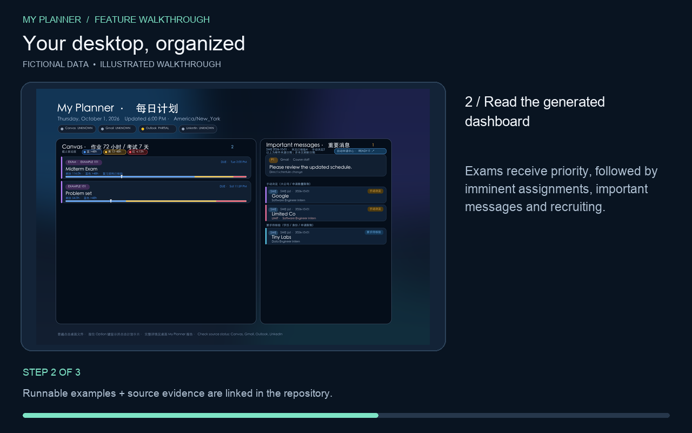
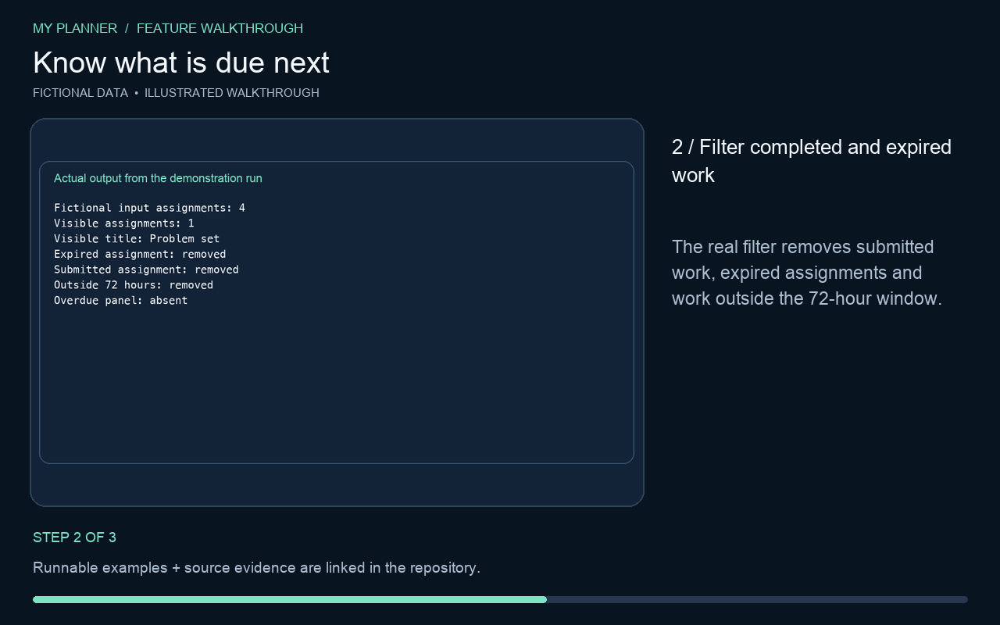
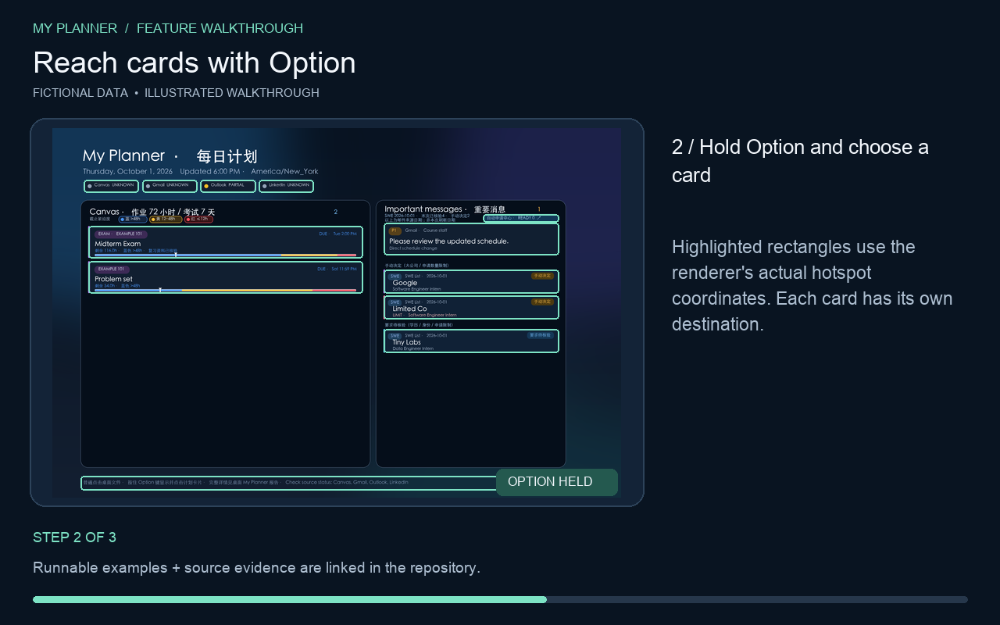
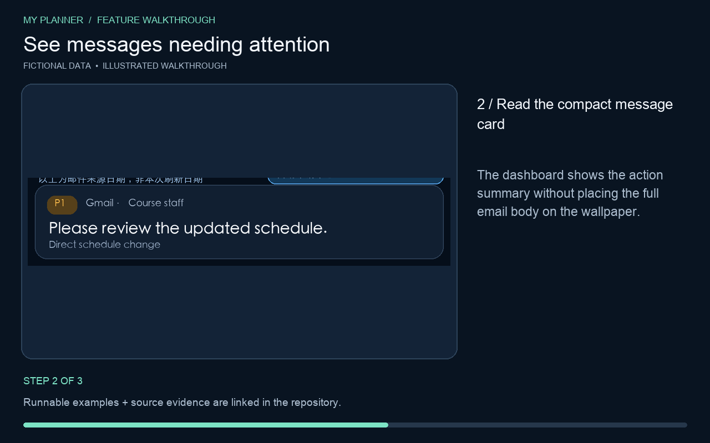
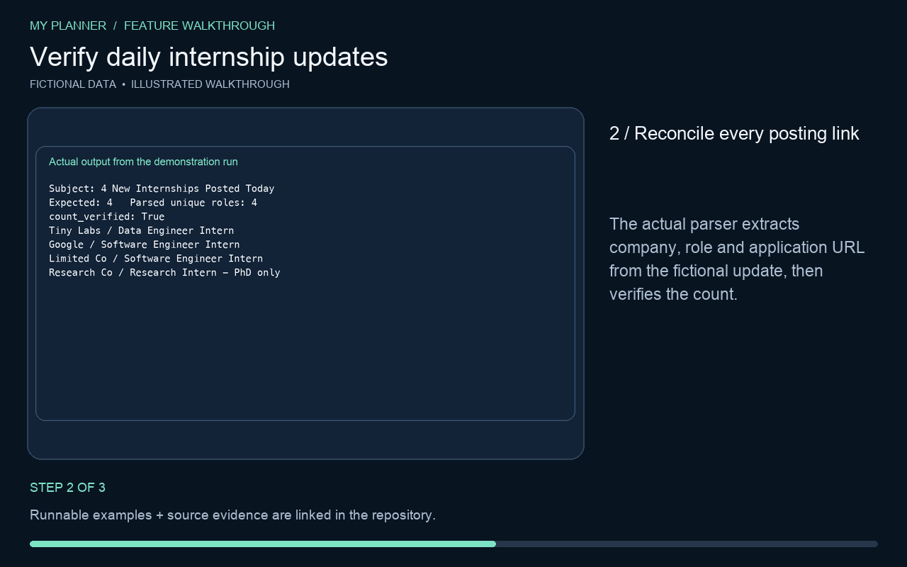
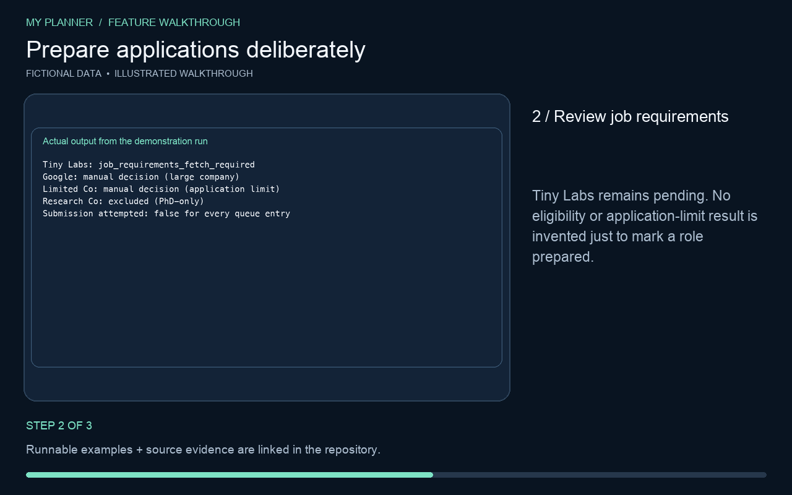
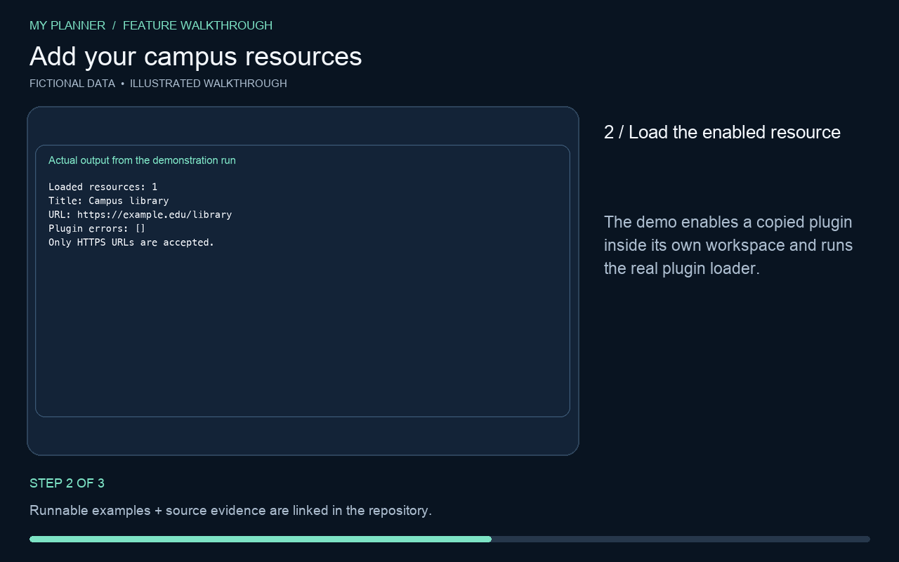
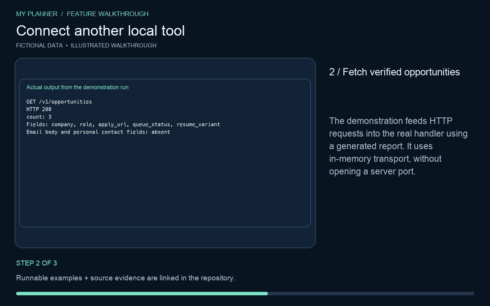
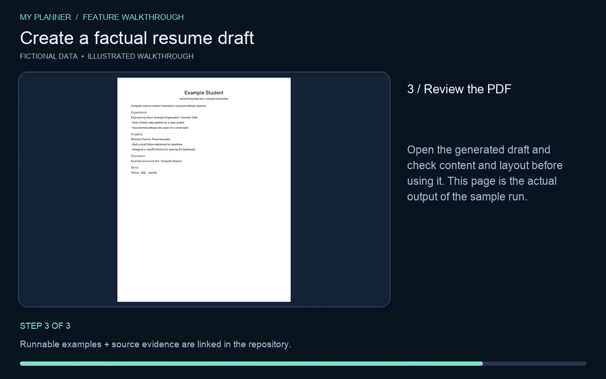
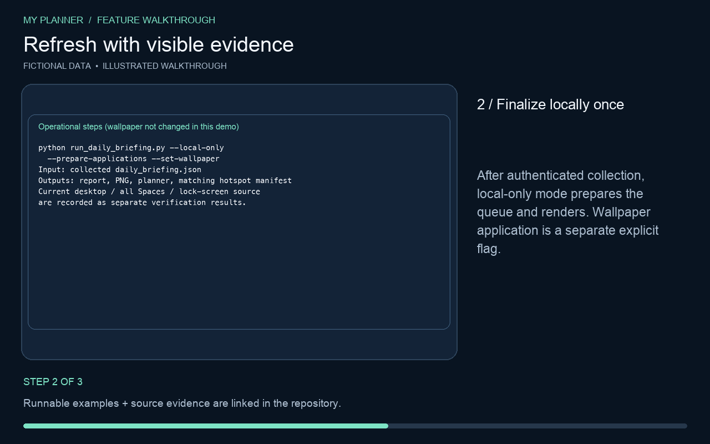

# Feature demonstrations

Every feature below has a step-by-step guide, an image, an animated preview and a 16-second MP4.

These are illustrated walkthroughs built from actual program outputs and fictional fixtures. They are not a recording of live Gmail, Canvas or job applications. The Option-key sequence is an interaction illustration. No real messages, credentials or résumés appear.

[Watch the video gallery](https://henry653.github.io/macos-desktop-assistant/) · [Demo evidence](media/evidence.json) · [Reproduction script](../tools/build_feature_demos.py)

## Your desktop, organized

Render one briefing as wallpaper, an HTML planner and a full report.

[Watch MP4](media/01-dashboard.mp4) · [Animated preview](media/01-dashboard.gif)

1. **Provide a structured briefing:** Use examples/daily_briefing.example.json to try the app without connecting an account.
2. **Read the generated dashboard:** Exams receive priority, followed by imminent assignments, important messages and recruiting.
3. **Open the local planner:** The HTML and Markdown outputs preserve the details and individual source links.

## Know what is due next

Show seven days of exams and 72 hours of actionable assignments.

[Watch MP4](media/02-deadlines-exams.mp4) · [Animated preview](media/02-deadlines-exams.gif)

1. **Review upcoming assessments:** Confirmed exams link to their verified review material; missing material falls back to the course source.
2. **Filter completed and expired work:** The real filter removes submitted work, expired assignments and work outside the 72-hour window.
3. **Keep the whole exam inventory:** An exam stays recorded even when it is outside the seven-day display window. Coverage remains partial until all sources are checked.

## Reach cards with Option

Hold Option to interact; double-tap Option to open the foreground planner.

[Watch MP4](media/03-option-navigation.mp4) · [Animated preview](media/03-option-navigation.gif)

1. **Leave the desktop click-through:** With Option released, the transparent overlay lets Finder receive your clicks.
2. **Hold Option and choose a card:** Highlighted rectangles use the renderer's actual hotspot coordinates. Each card has its own destination.
3. **Double-tap Option:** Open the full HTML planner in the foreground when another window covers the desktop. This is an interaction illustration, not a live screen recording.

## See messages needing attention

Show concise role, action and urgency summaries with honest source status.

[Watch MP4](media/04-important-messages.mp4) · [Animated preview](media/04-important-messages.gif)

1. **Supply reviewed message summaries:** The renderer accepts source, sender role, action, urgency and a safe source link.
2. **Read the compact message card:** The dashboard shows the action summary without placing the full email body on the wallpaper.
3. **Check source status:** A failed connection is displayed as partial or unavailable; it is not interpreted as an empty inbox.

## Verify daily internship updates

Parse real email formats and reconcile the headline count with unique job links.

[Watch MP4](media/05-swe-list.mp4) · [Animated preview](media/05-swe-list.gif)

1. **Configure Gmail read-only access:** Provide your own OAuth client and complete consent. Scheduled collection searches the SWE List sender; this demo uses a local mail fixture.
2. **Reconcile every posting link:** The actual parser extracts company, role and application URL from the fictional update, then verifies the count.
3. **Reject incomplete results:** Changing the fixture headline to five while retaining four links makes validation fail; the job queue must not treat it as a complete update.

## Prepare applications deliberately

Keep unknown requirements, manual decisions and confirmed preparation distinct.

[Watch MP4](media/06-application-preparation.mp4) · [Animated preview](media/06-application-preparation.gif)

1. **Build a local preparation queue:** Only count-verified opportunities enter the queue. Title rules and stable fingerprints remove exclusions and duplicates.
2. **Review job requirements:** Tiny Labs remains pending. No eligibility or application-limit result is invented just to mark a role prepared.
3. **Start an interactive review:** The application-center card creates a user-visible review request. An application can only be recorded as submitted after separate confirmation and an official success state.

## Add your campus resources

Enable local JSON plugins to add useful HTTPS resource links.

[Watch MP4](media/07-campus-plugins.mp4) · [Animated preview](media/07-campus-plugins.gif)

1. **Copy the example plugin:** Create a local JSON file under plugins/ and give it a unique identifier.
2. **Load the enabled resource:** The demo enables a copied plugin inside its own workspace and runs the real plugin loader.
3. **Find it in the planner:** The generated HTML planner contains the campus resource link. Plugins are data-only and do not execute arbitrary code.

## Connect another local tool

Expose verified opportunities through a read-only loopback API.

[Watch MP4](media/08-local-api.mp4) · [Animated preview](media/08-local-api.gif)

1. **Start the service:** Point the API at a verified report. It binds only to the local loopback interface.
2. **Fetch verified opportunities:** The demonstration feeds HTTP requests into the real handler using a generated report. It uses in-memory transport, without opening a server port.
3. **Keep the integration read-only:** Mutation requests receive an explicit 405 response. The service is not an unattended application-submission endpoint.

## Create a factual resume draft

Select and reorder supplied experience for a local job description.

[Watch MP4](media/09-tailored-resume.mp4) · [Animated preview](media/09-tailored-resume.gif)

1. **Supply your facts and the job text:** Use a private JSON profile and a local job-description file. The included profile is entirely fictional.
2. **Inspect the selected facts:** The generator ranks existing skills and bullets by overlap with the job description. It does not rewrite experience or call an external model.
3. **Review the PDF:** Open the generated draft and check content and layout before using it. This page is the actual output of the sample run.

## Refresh with visible evidence

Plan bounded collection, preserve source failures and verify presentation separately.

[Watch MP4](media/10-refresh-recovery.mp4) · [Animated preview](media/10-refresh-recovery.gif)

1. **Generate the refresh plan:** Inspect the plan before collecting. Announcements still need checking even when a cached syllabus is reusable.
2. **Finalize locally once:** After authenticated collection, local-only mode prepares the queue and renders. Wallpaper application is a separate explicit flag.
3. **Verify or preserve last good:** The renderer hashes the image used by its hotspot manifest. Recovery logic is tested with isolated fixtures; this video does not claim to verify a live lock screen.
